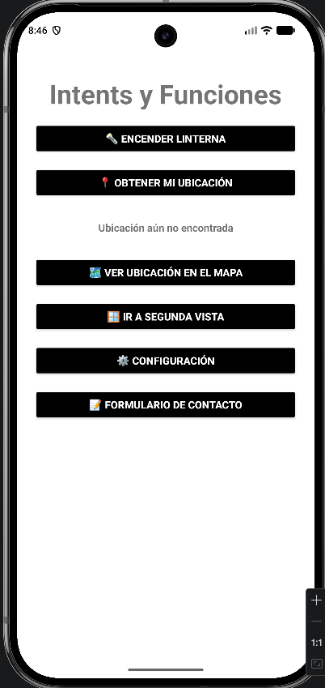
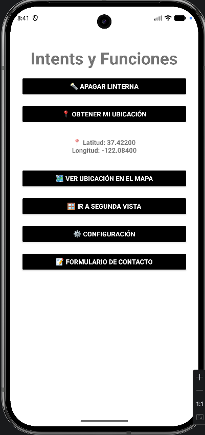
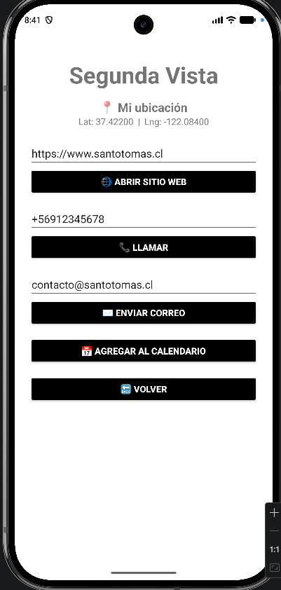
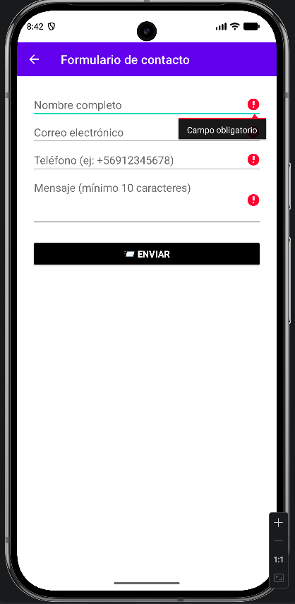
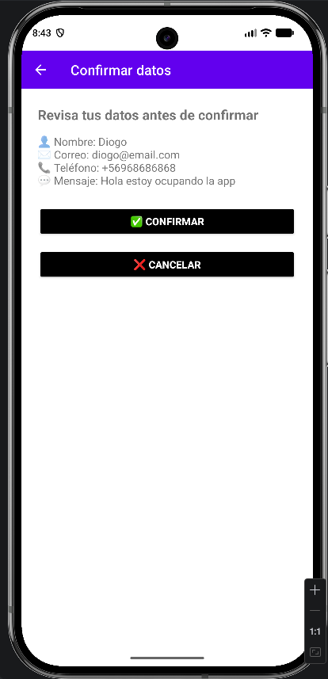
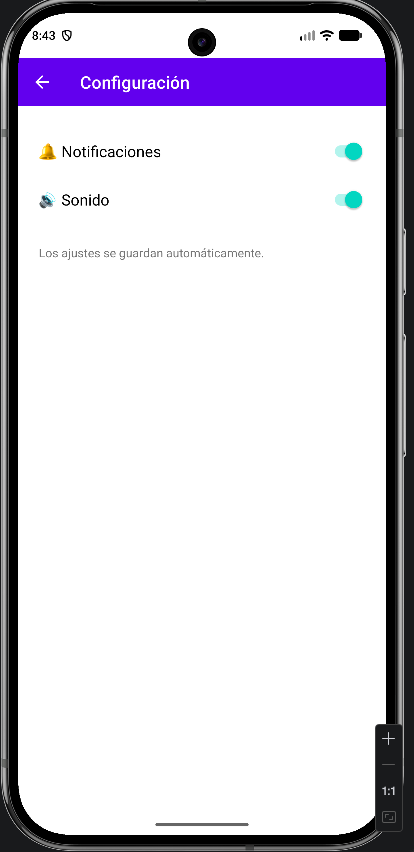

#  AppPrueba — Prototipo 2: Intents implícitos y explícitos #

Aplicación Android nativa (Java) desarrollada para la asignatura **Programación Android** (Santo Tomás). En este segundo prototipo se implementan **8 intents**: **5 implícitos** (abren otras apps del sistema) y **3 explícitos** (navegan entre pantallas del propio proyecto), además de **validaciones** de datos.

>  **Autor:** _(Diogo Von Muhlenbrock)_
>  **Fecha:** octubre 2026

---

##  Resumen del proyecto ##

| Aspecto | Detalle |
|---|---|
|  Paquete | `com.devst.appprueba` |
|  Lenguaje | Java 11 |
|  IDE | Android Studio Panda 1 (2025.3.1) |
|  Android Gradle Plugin (AGP) | 9.0.1 |
|  Gradle | 9.2.1 |
|  compileSdk / targetSdk | 36 / 36 |
|  minSdk | 31 (Android 12) |
|  UI | Vistas XML con Material Components |

### Pantallas ###

| Pantalla | Archivo | Función |
|---|---|---|
|  Principal | `Login.java` | Menú: linterna, ubicación, mapa y accesos a las demás pantallas |
|  Segunda vista | `Segundavista.java` | Recibe datos por `putExtra` y lanza 4 intents implícitos |
|  Configuración | `ConfigActivity.java` | Ajustes internos con Toolbar y botón "Atrás" |
|  Formulario | `FormActivity.java` | Formulario con validaciones |
|  Confirmación | `ConfirmActivity.java` | Confirma los datos y devuelve un resultado |
|  Utilidades | `Utilidades.java` | Lanzamiento seguro de intents y manejo de márgenes (insets) |

### Permisos ###

| Permiso | Uso |
|---|---|
| `CAMERA` | Encender la linterna |
| `ACCESS_FINE_LOCATION` / `ACCESS_COARSE_LOCATION` | Obtener la ubicación para mostrarla en el mapa |

Los permisos se solicitan en tiempo de ejecución con `registerForActivityResult()`. Los intents implícitos usados **no requieren permisos peligrosos** (por ejemplo, `ACTION_DIAL` no necesita `CALL_PHONE`).

---

##  Intents implícitos (5) ##

| Nº | Intent | Acción | Pantalla |
|---|---|---|---|
| 1 |  Google Maps | `ACTION_VIEW` con `geo:lat,lng?q=...` | Principal |
| 2 |  Página web | `ACTION_VIEW` con `https://` | Segunda vista |
| 3 |  Marcador telefónico | `ACTION_DIAL` con `tel:` | Segunda vista |
| 4 |  Correo electrónico | `ACTION_SENDTO` con `mailto:` (asunto y cuerpo prellenados) | Segunda vista |
| 5 |  Calendario | `ACTION_INSERT` con `Events.CONTENT_URI` | Segunda vista |

###  Pasos de prueba ###

**1. Google Maps**
1. En la pantalla principal pulsa **📍 Obtener mi Ubicación** y acepta el permiso.
2. Verifica que se muestren la latitud y la longitud.
3. Pulsa **🗺️ Ver ubicación en el Mapa**: se abre la app de mapas con un marcador.
4. ⚠️ Si pulsas el botón sin ubicación, aparece un aviso y no se abre nada.

**2. Página web**
1. Pulsa **🪟 Ir a segunda vista**.
2. Deja la dirección `https://www.santotomas.cl` (o escribe otra) y pulsa **🌐 Abrir sitio web**.
3. Se abre el navegador. Si borras el campo o escribes algo inválido, aparece un error en el campo.

**3. Marcador telefónico**
1. En la segunda vista, escribe un teléfono válido (ej: `+56912345678`).
2. Pulsa **📞 Llamar**: se abre el marcador con el número, **sin llamar automáticamente**.
3. Con un número inválido (ej: `123`) aparece un error.

**4. Correo electrónico**
1. En la segunda vista, escribe un correo válido.
2. Pulsa **✉️ Enviar correo**: se abre la app de correo con destinatario, asunto y cuerpo prellenados.
3. Con un correo inválido aparece un error.

**5. Calendario**
1. En la segunda vista pulsa **📅 Agregar al calendario**.
2. Se abre el calendario con el evento prellenado (título, ubicación y hora: mañana a las 10:00).
3. 📌 Requiere una app de calendario instalada; si no existe, se muestra un mensaje.

---

##  Intents explícitos (3) ##

| Nº | Navegación | Detalle |
|---|---|---|
| 1 | 🏠 `Login` → 🪟 `Segundavista` | Envía datos con `putExtra` (nombre, latitud y longitud) |
| 2 | 🏠 `Login` → ⚙️ `ConfigActivity` | Pantalla de ajustes con Toolbar y botón "Atrás" |
| 3 | 📝 `FormActivity` → ✅ `ConfirmActivity` | Envía datos y recibe respuesta con `registerForActivityResult()` |

> ℹ El botón **📝 Formulario de contacto** de la pantalla principal solo abre `FormActivity`; el intent explícito con resultado es el de `FormActivity` hacia `ConfirmActivity`.

###  Pasos de prueba ###

**1. Con datos extra (`putExtra`)**
1. Pulsa **🪟 Ir a segunda vista**.
2. Verifica que se muestren el nombre del lugar y sus coordenadas.
3. Si antes obtuviste tu ubicación, se muestran tus coordenadas; si no, las de la Plaza de Armas de Santiago.
4. Pulsa **🔙 Volver** para regresar.

**2. Configuración con Toolbar**
1. Pulsa **⚙️ Configuración**.
2. Activa o desactiva los interruptores (se guardan con `SharedPreferences`).
3. Toca la flecha ← de la Toolbar para volver.

**3. Formulario con resultado**
1. Pulsa **📝 Formulario de contacto**.
2. Completa nombre, correo, teléfono y mensaje, y pulsa **📨 Enviar**.
3. En la pantalla de confirmación revisa los datos y pulsa **✅ Confirmar**.
4. Al volver al formulario aparece **✅ Solicitud confirmada para ...**.
5. Si pulsas **❌ Cancelar** (o la flecha ←), aparece **❌ Envío cancelado**.

---

##  Validaciones ##

| Dónde | Validación |
|---|---|
|  Formulario: nombre | Obligatorio, mínimo 3 letras, sin números ni símbolos |
|  Formulario: correo | Obligatorio y con formato válido (`Patterns.EMAIL_ADDRESS`) |
|  Formulario: teléfono | Obligatorio, de 8 a 12 dígitos, puede iniciar con `+` |
|  Formulario: mensaje | Mínimo 10 caracteres |
|  Segunda vista: URL | No vacía y con formato válido (agrega `https://` si falta) |
|  Segunda vista: teléfono | De 8 a 12 dígitos, puede iniciar con `+` |
|  Segunda vista: correo | Formato válido |
|  Principal: mapa | Exige haber obtenido la ubicación antes |
|  Linterna / 📍 Ubicación | Manejo del permiso denegado y de dispositivos sin flash |
|  Intents implícitos | `try/catch (ActivityNotFoundException)` con mensaje si no hay app que lo maneje |

Los errores se muestran directamente en el campo con `setError()`.

---

##  Capturas de pantalla ##

###  Pantalla principal


###  Ubicación obtenida y mapa


###  Segunda vista (extras e intents implícitos)


###  Formulario con validaciones


###  Confirmación y resultado


###  Configuración


---

##  Cómo compilar y ejecutar ##

###  Requisitos ###
- Android Studio **Panda 1 (2025.3.1)** o superior
- JDK 11 o superior (incluido con Android Studio)
- Un emulador o teléfono con Android 12 (API 31) o superior

###  Ejecutar desde Android Studio ###
1. Clona el repositorio: `git clone <URL-del-repositorio>`
2. En Android Studio: **File > Open** y selecciona la carpeta del proyecto (la que contiene `gradlew`).
3. Espera a que termine la sincronización de Gradle (**Sync**).
4. Elige un dispositivo y pulsa **▶ Run**.

###  Generar el APK debug ###
**Con Android Studio:** **Build > Build APK(s)**.

**Con la terminal** (desde la raíz del proyecto):

```bash
# Windows
gradlew.bat assembleDebug

# Linux / macOS
./gradlew assembleDebug
```

El APK queda en:

```
app/build/outputs/apk/debug/app-debug.apk
```

>  La carpeta `build/` no se sube al repositorio (está en `.gitignore`), por eso el APK se genera con los pasos anteriores.

---

##  Flujo de trabajo en Git ##

-  Rama principal: `main`
-  Rama de trabajo: `feature/intents`
-  Commits atómicos y descriptivos (un commit por funcionalidad)

---

##  Estructura del proyecto ##

```
AppPrueba/
├── app/
│   └── src/main/
│       ├── java/com/devst/appprueba/
│       │   ├── Login.java
│       │   ├── Segundavista.java
│       │   ├── ConfigActivity.java
│       │   ├── FormActivity.java
│       │   ├── ConfirmActivity.java
│       │   └── Utilidades.java
│       ├── res/layout/        (pantallas XML)
│       └── AndroidManifest.xml
├── gradle/
├── build.gradle.kts
└── README.md
```
